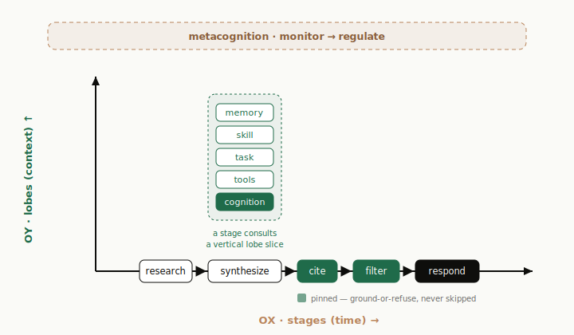

# agent-sdk — PreAct

> **A pre-structured, fully inspectable agent-reasoning engine — for developers who want to own every building block of an AI agent, not hand the turn to a model and hope.**

[](./LICENSE)
[](https://www.python.org/)
[](#status)

**agent-sdk** is a Python SDK for building AI agents whose **reasoning process you fully control** —
the context, the prompt, the steps, the control flow, the durable state. Instead of *free-acting*
(vanilla ReAct: the model picks tool calls turn by turn and the prompt accumulates toward its
limit), an agent **reasons through a deliberate pipeline you assemble, inspect, and tune** — layered
**lobes** (what context fires) → reusable **stages** (the reasoning steps) → intent **flows** (the
path), with **metacognition** supervising. The deterministic core (intent recognition, activation,
attention/budget, flow resolution) is a pure function of `(spec, context)`; everything that touches
the outside world (LLM, tools, embeddings, stores, queues) is a narrow protocol with an in-memory
default.

## Why agent-sdk

Built for developers who want **durable reasoning and fully customized agent behavior, controlled
from the reasoning process itself** — not a prompt-and-pray wrapper.

- **Pre-structured reasoning** — every turn runs a deliberate pipeline you can read, reorder, and
  tune, instead of a turn-by-turn tool loop.
- **Multi-stage reasoning** — a flow is an ordered sequence of stages (`plan → execute → deliver`),
  each with its own prompt, context, loop mode, tools, and model. Optimize one step without touching
  the rest.
- **Context that funnels, not floods** — the prompt is re-tiered every hop (inject in full · hint +
  fetch · offload) toward *useful reasoning per token*, not maximum context.
- **Fully inspectable** — each turn emits a structured trace (path, flow, per-stage prompts, lobe
  activations, tool calls, metacognition, token cost), renderable to a standalone HTML viewer. No
  black boxes.
- **Opt-in plugins** — package a whole capability (lobes, stages, flows, tools, even MCP servers) as
  one plugin, then mount, disable, or replace it. The core ships domain-free.
- **Durable, long-rail tasks** — a scoped `memory` tool (`turn → conversation → channel → user →
  bot`) and a task mode that persists working state and resumes across runs.
- **Provider-agnostic** — Anthropic, OpenAI-compatible, MiniMax, and a deterministic fake behind one
  interface; the side-effect-free core ports cleanly to other languages.
- **Benchmarkable** — live, ground-truth benchmarks (`taskbench`, `coding-agent-bench`) grade real
  behavior against verifiable outcomes, not stubs.

## Install

```bash
pip install agent-sdk                     # core
pip install "agent-sdk[openai]"           # + OpenAI-compatible client
pip install "agent-sdk[redis]"            # + Redis session/memory stores & queue serving
pip install "agent-sdk[openai,redis]"     # everything
```

Requires Python 3.12+. From source: `git clone … && cd agent-sdk && uv sync` (or `pip install -e ".[dev]"`).

## Quickstart

```python
from agent_sdk import PreactAgent, tool
from agent_sdk.clients import AnthropicClient

@tool
async def search(query: str, top_k: int = 5) -> str:
    "Search the knowledge base."          # docstring → description; signature → JSON schema

agent = PreactAgent(
    client=AnthropicClient("claude-opus-4-8"),
    instructions="You are a helpful research assistant.",
    tools=[search],
    # lobes / stages / flows default to the built-in PreAct network when omitted
)

result = await agent.query("What changed in v2?")     # one-shot → AgentResult
async for event in agent.act("What changed in v2?"):  # streaming → typed events
    print(event)
```

For tests/dev, swap in the deterministic `FakeClient` (no network):

```python
from agent_sdk.clients import FakeClient
agent = PreactAgent(client=FakeClient(["v2 added streaming."]), instructions="…")
```

For a runnable, real-world reference, see [`examples/coding-agent/`](./examples/coding-agent/) — a
multi-stage coding agent (triage → explore → plan → implement → verify) that edits a real
filesystem, built entirely on the public surface in ~300 lines, with an offline deterministic demo
and a `--inspect` routing probe.

## The model

<p align="center">
  
</p>

Instead of free-acting turn by turn (and accumulating prompt toward the context limit), PreAct
shapes acting *up front*: it decouples **what the agent thinks about** from **how it progresses**,
tunes each independently, and runs a metacognition layer over both.

- **Context axis — `lobes`.** Small thinking units that select context and local behavior for a
  slice of the turn; they never decide the whole plan.
- **Time axis — `stages` / `flows`.** A flow is a named execution path; each step owns its lobe
  slice, loop mode, and tool allowlist. *New capability is a registry row, not an interpreter branch.*
- **Paths = intent.** Each turn an intent is scored from free signals — **never an LLM judging the
  pipeline** — biasing the lobes and selecting the flow.
- **Metacognition.** Always on (`monitor → regulate`): may adjust the lobe slice, retry, or skip a
  step, but never lets the LLM judge the pipeline and never skips a pinned safety step (`cite` /
  `filter`).

The target is *useful reasoning per token*: context is re-tiered every hop (inject · hint + fetch ·
offload), so the prompt funnels toward the answer instead of accumulating toward the limit.

Deeper dives: [the OX/OY plane](./docs/concepts/architecture.md) ·
[intent &amp; paths](./docs/concepts/intent-and-paths.md) ·
[context management](./docs/concepts/react-context-management.md) ·
[memory](./docs/concepts/universal-memory.md) ·
[long-rail tasks](./docs/concepts/task-execution-mode.md) ·
[reply flow](./docs/concepts/reply-flow.md).

## Core vs. extensions

The SDK draws a deliberate line between what *every* agent is and what you *add* to it.

- **Core (`agent_sdk/lobes/`)** — the lobes intrinsic to every PreAct agent: the **cognition**
  reasoning spine (condense → scope → classify → plan → research → synthesize), **tools** (adaptive
  exposure), **skills** (progressive disclosure), **memory** (recall), and the **reply** flow
  (`respond`). Plus the lobe framework and path recognizers. These are not toggleable. *(Core is
  domain-free — task execution, grounding, and styling are plugins.)*
- **Extensions (`agent_sdk/plugins/`)** — pluggable, folder-per-plugin capabilities composed onto
  the core:
  - **default-on but toggleable:** `SafetyPlugin` (`cite` / `filter` grounding) and `FormatPlugin`
    (channel / language / tone styling).
  - **opt-in capabilities:** `TaskPlugin` (todo-driven multi-stage task execution — owns its lobe /
    path / stages / `todos` tool, each independently tunable), `PluginMCP` (mount MCP servers),
    `PluginWorkspace` (sandboxed filesystem), `PluginOTel` (OpenTelemetry), `PluginGuardrails`
    (pre/post checks), and `PluginSupportTriage` (a worked example carrying one capability of every
    kind).

A plugin contributes the **full capacity surface** — lobes, stages, paths/flows, skills, tools, and
even its own **MCP servers** (connected + discovered at turn start, then registered like any tool).
Manage them with a `PluginRegistry` (register / override / enable / disable) and pass it straight to
`PreactAgent(plugins=…)`. An agent with no extra plugins is **byte-identical** to the default
network. See [`docs/concepts/plugins.md`](./docs/concepts/plugins.md).

```python
from agent_sdk import PreactAgent
from agent_sdk.plugins import PluginRegistry, builtin_registry, PluginWorkspace

reg = builtin_registry()                  # no-config builtins (otel, guardrails)
reg.register(PluginWorkspace(driver="virtual"))
reg.disable("format")                     # turn an extension off
agent = PreactAgent(client=…, plugins=reg)
```

## What's here

| Area | Modules |
|---|---|
| Façade + kernel | `agent.py` (`PreactAgent`), `engine.py` (`Engine`) |
| Building blocks | `activable.py`, `stages.py` (`Stage`), `flow_def.py` (`Flow`), `skill_def.py` (`Skill`), `signals.py` (declarative grammar), `preact/` (built-in network) |
| Tools | `tools.py` (`@tool`, `FunctionToolRuntime`) |
| Clients | `clients/` (`AnthropicClient`, `OpenAIClient`, `MiniMaxClient`, `MixedClient`, `FakeClient`) |
| Results + events | `result.py` (`AgentResult`, `Trace`, `Usage`, …), `events.py` (typed event union + `AgentStream`) |
| Persistence | `session.py`, `memory/` (`Memory` + the `memory` tool, `Scratchpad`), `stores/` (in-memory / Redis / SQL) |
| Reasoning control | `metacognition_facade.py` (`Metacognition`) |
| Core network | `lobes/` (cognition, tools, skills, memory, reply + framework + paths) |
| Extensions | `plugins/` — first-class plug-and-play units (lobes/stages/flows/skills/tools) + MCP (`mcp.py`); built-ins `SafetyPlugin`/`FormatPlugin`/`TaskPlugin`/`PluginWorkspace`/`PluginMCP`/`PluginOTel`/`PluginGuardrails`/`PluginSupportTriage`, managed via `PluginRegistry` |
| Serving | `serve.py` (`AgentWorker`, in-process + Redis queue/sink/lock) |
| Portability | `spec.py` (`PreactSpec` round-trip), `bench.py` (`Harness`/`Scenario`) |
| Base layers | `contracts/`, `network/`, `flows/`, `react/`, `guards/`, `inspection.py` |

## Status

**Beta.** The full public API in [`docs/api.md`](./docs/api.md) — the `PreactAgent` façade, the
generic `Engine` kernel, first-class `Stage`, `@tool`, multi-provider clients, Session/Memory
stores, the plugin/extension system, serving, the serializable spec, and the probe/inspect/bench
surface — is implemented and covered by the test suite (270+ tests). The API may still shift before
1.0; changes are tracked in [`CHANGELOG.md`](./CHANGELOG.md).

## Leaf invariant

`agent_sdk` is a **leaf**: it imports the stdlib + third-party deps (`anthropic`, `numpy`,
`pydantic`, `cachetools`, optionally `openai` / `redis`) and other `agent_sdk` modules — never any
host application package. Enforced by `tests/test_sdk_isolation.py`, so the SDK stays standalone and
publishable.

## Develop

```bash
uv sync                                       # or: pip install -e ".[dev]"
uv run python -m pytest -q                    # the suite (270+ tests)
uv run ruff check agent_sdk                   # lint
uv run ruff format agent_sdk                  # format
```

Benchmarks are **live-only** (no LLM stubs — a stubbed bench is an integration test): set provider
credentials, then e.g. `python benchmarks/extensionbench/run.py --live` (emits `READY`/`NOT_READY`).

## Documentation

- [`docs/api.md`](./docs/api.md) — the public surface
- [`docs/contracts.md`](./docs/contracts.md) — the dependency-free base types
- [`docs/preact.md`](./docs/preact.md) — the model
- [`docs/porting.md`](./docs/porting.md) — Rust/Go/JS ports
- [`docs/building-a-harness.md`](./docs/building-a-harness.md) — benches & evals

For the deeper mental model, the concept docs go axis by axis:
[`agent-core-overview.md`](./docs/concepts/agent-core-overview.md) (start here),
[`architecture.md`](./docs/concepts/architecture.md) (the OX/OY plane),
[`intent-and-paths.md`](./docs/concepts/intent-and-paths.md),
[`reply-flow.md`](./docs/concepts/reply-flow.md) (collectors → response stage),
[`plugins.md`](./docs/concepts/plugins.md) (core vs. extensions + MCP),
[`react-context-management.md`](./docs/concepts/react-context-management.md) (PreAct),
[`tool-use-at-scale.md`](./docs/concepts/tool-use-at-scale.md),
[`context-memory.md`](./docs/concepts/context-memory.md),
[`universal-memory.md`](./docs/concepts/universal-memory.md), and
[`task-execution-mode.md`](./docs/concepts/task-execution-mode.md).

## Contributing

Contributions are welcome — see [`CONTRIBUTING.md`](./CONTRIBUTING.md) for the dev setup, the
invariants every change must keep (leaf isolation, default-network parity, citations-mandatory), and
the test/lint gates.

## License

Licensed under the [Apache License 2.0](./LICENSE). See [`NOTICE`](./NOTICE) for attribution.
