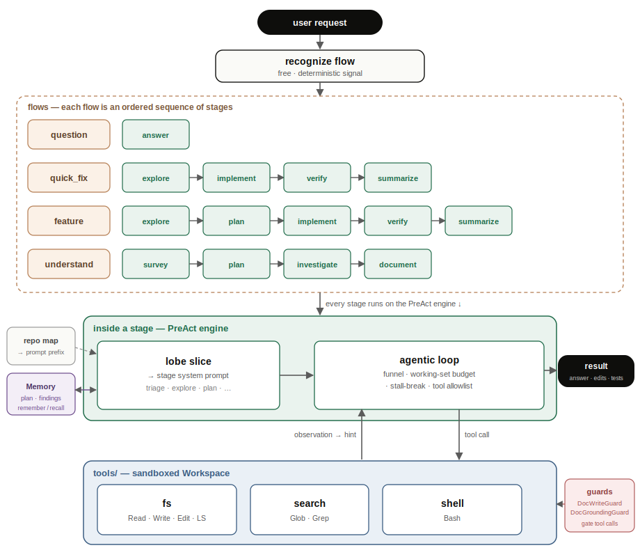

# coding-agent — a Claude-Code-grade coding agent on `agent_sdk`

A multi-stage, tool-using coding agent built on the SDK that works in a **real,
large** repository: it navigates with glob/grep, reads exact files, plans, edits,
runs the test suite, and answers deep questions about the code — sustaining
**hundreds of tool calls** in a bounded context via **PreAct**. Built
entirely on the SDK's public surface.

The whole capability is packaged as **one first-class plugin** — `CodingPlugin`
(`coding_agent/agent.py`) contributes its lobes + stages + flows + tools + the read-only write
guard through the plugin seam, and `build_coding_agent` just mounts it on a bare base network
(`plugins=[CodingPlugin(root)]`). Compose it with other plugins or give it an MCP server it
owns — `build_coding_agent(root, client=…, mcp_servers=[{...}])` / `plugins=[…]` pass straight
through.

**Built for scale:**
- **Claude Code's canonical tools** — `Read` (line numbers + offset/limit), `Write`,
  `Edit` (exact-string), `LS`, `Glob` (`**/*.py`), `Grep`, `Bash` — same names and
  param shapes (`file_path`/`old_string`/…) the model already knows from training, so
  prompts stay terse and accuracy stays high.
- **PreAct** (`funnel=True`) — spent tool observations shrink to hints, so
  long exploration doesn't overflow the window.
- **High hop budgets** (explore 50 · implement 80 · verify 40 · answer 80).
- **Durable memory** — the agent tracks its plan/goals across turns.

See [`EVALUATION.md`](./EVALUATION.md) for a candid assessment of the SDK
(API ergonomics, live MiniMax performance numbers, behavior findings, and
prioritized improvement suggestions) produced by building this.

## Architecture

One turn flows top-down: recognize the intent (free, deterministic) → run that flow's stage
sequence → each stage composes a lobe slice into its prompt and drives a bounded PreAct loop over
the workspace tools. Memory, the repo map, and the guards are the cross-cutting seams.



## Shape

```
request ──▶ recognize flow (free, deterministic)
            ├─ question   → answer
            ├─ quick_fix  → explore → implement → verify → summarize
            ├─ feature    → explore → plan → implement → verify → summarize
            └─ understand → survey → plan → investigate → document   (writes ARCHITECTURE.md)
```

The capability is one installable [`CodingPlugin`](./coding_agent/agent.py) over a few focused
subpackages — the same `lobes` / `flows`+`stages` / `tools` split the SDK itself uses. Each
flow, stage, and lobe is its own file; open the one you want.

### Flows — intents recognized free + deterministically · [`flows/__init__.py`](./coding_agent/flows/__init__.py)

- [**feature**](./coding_agent/flows/__init__.py) — a multi-step change (feature / refactor / new code): explore → plan → implement → verify → summarize
- [**quick_fix**](./coding_agent/flows/__init__.py) — a small bug fix: explore → implement → verify → summarize
- [**understand**](./coding_agent/flows/__init__.py) — map a whole system + write `ARCHITECTURE.md`: survey → plan → investigate → document
- [**question**](./coding_agent/flows/__init__.py) — answer a question about the code (no edits): answer

### Stages — bounded units of work (a lobe slice + tool allowlist + loop + hop budget) · [`flows/stages/`](./coding_agent/flows/stages)

- [**explore**](./coding_agent/flows/stages/explore.py) — navigate + read the codebase to ground the work (agentic, 50 hops)
- [**plan**](./coding_agent/flows/stages/plan.py) — decompose a multi-step change into ordered steps (single)
- [**implement**](./coding_agent/flows/stages/implement.py) — make the change on disk (agentic, 80 hops)
- [**verify**](./coding_agent/flows/stages/verify.py) — run the tests and fix failures (agentic, 40 hops)
- [**answer**](./coding_agent/flows/stages/answer.py) — deeply explore, then answer a question about the code (agentic, 80 hops)
- [**summarize**](./coding_agent/flows/stages/summarize.py) — report what changed + the test result (single)
- [**survey**](./coding_agent/flows/stages/survey.py) — map the repository structure top-down (agentic, 40 hops)
- [**investigate**](./coding_agent/flows/stages/investigate.py) — read each subsystem, save findings to memory (agentic, 80 hops)
- [**document**](./coding_agent/flows/stages/document.py) — aggregate findings + write the architecture document (agentic, 50 hops)

### Lobes — the coding disciplines as context workers · [`lobes/`](./coding_agent/lobes)

- [**triage**](./coding_agent/lobes/triage.py) — classify the request: a question, a quick fix, or a feature
- [**explore**](./coding_agent/lobes/explore.py) — read the relevant code before proposing or making changes
- [**plan**](./coding_agent/lobes/plan.py) — decompose a multi-step change into concrete, ordered steps
- [**implement**](./coding_agent/lobes/implement.py) — write minimal, correct code that matches the surrounding style
- [**surveyor**](./coding_agent/lobes/surveyor.py) — map a large codebase's structure breadth-first before diving in
- [**verify**](./coding_agent/lobes/verify.py) — run the real test suite and report the result honestly
- [**summarize**](./coding_agent/lobes/summarize.py) — state concisely what changed and the test result
- [**documenter**](./coding_agent/lobes/documenter.py) — aggregate findings into a clear architecture document

Plus [**tools/**](./coding_agent/tools) — Claude Code's canonical `Read`/`Write`/`Edit`/`LS`/`Glob`/
`Grep`/`Bash` over a sandboxed [`Workspace`](./coding_agent/tools/workspace.py)
([fs](./coding_agent/tools/fs.py) · [search](./coding_agent/tools/search.py) ·
[shell](./coding_agent/tools/shell.py)) — and [**repomap.py**](./coding_agent/repomap.py), a
deterministic repo map injected into the prompt so the agent orients on the *real* tree.

## Run it

```bash
# from the repo root, with the venv that has agent_sdk installed:

# 1) Offline deterministic demo — real fs edits in a temp sandbox, scripted model:
python packages/agent-sdk/examples/coding-agent/demo.py

# 2) No-LLM routing probe (free, instant):
python packages/agent-sdk/examples/coding-agent/main.py --inspect "fix the failing test"

# 3) Live — UNDERSTAND a large repo (explore + answer, no edits):
python packages/agent-sdk/examples/coding-agent/live_run.py \
    "How does the engine drive one turn? Cite the key files/functions." \
    --root packages/agent-sdk/agent_sdk

# 4) Live — make a change on your repo:
python packages/agent-sdk/examples/coding-agent/main.py \
    --root /path/to/repo "add a multiply function to calculator.py and a test"

# 5) Live sandbox feature demo (loads .env → MiniMax, verifies independently):
python packages/agent-sdk/examples/coding-agent/live_run.py
```

## Latest live result (MiniMax-M2.7, on this repo)

Asked *"What does the engine's agentic tool loop do, and how does PreAct
keep the context bounded? Cite the files/functions."* against the 245-file
`agent_sdk` package — the agent routed to `answer`, navigated with **18 tool
calls** (`LS` → `Glob('**/*.py')` → `Read` ×12 of the relevant files:
`engine.py`, `react/funnel.py`, `engine_context.py`), and produced a cited
architectural explanation. 90s · 86k in-tokens · ~$0.29 — PreAct kept the
context bounded across the run. (Routing fix: a long *question* now goes to
explore→answer, never to the `feature` change flow.)

## Test it (real fs, no network)

```bash
uv --directory packages/agent-sdk run python -m pytest examples/coding-agent/test_coding_agent.py -q
```

The suite asserts the agent routes correctly, **actually edits files on disk**,
**runs the real test suite**, and reports honestly.

## Safety note

`bash` executes arbitrary shell in the workspace (so the agent can run your tests),
and `Write`/`Edit` modify files in place. That is intentional for a
coding agent but **powerful** — run untrusted tasks in a sandbox/container. See
EVALUATION.md finding #6 (a tool-authorization seam is a recommended SDK addition).
